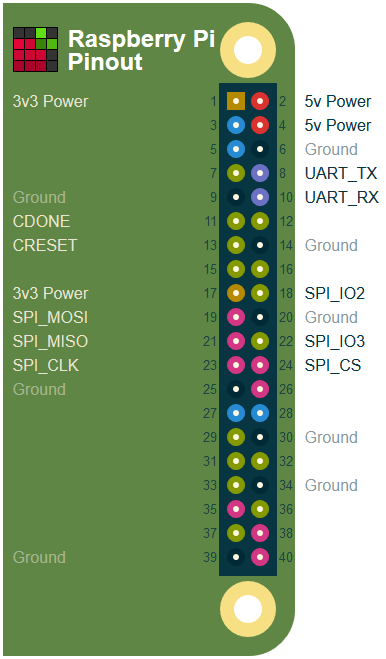

# Fomu FPGA Tools

The EVT version of Fomu is a "stretch" PCB with a Raspberry Pi header.  Additionally, the factory test jig for production versions of Fomu has pins that match up with a test jig with the same pinout.

These tools can be used to control an FPGA and its accompanying SPI flash chip.

## Building

To build this repository, simply run `make`.

## Test Jig Setup

The EVT boards can be attached directly to the Raspberry Pi as a "hat".  When building a test jig, attach wires according to the following image:



The only pins that are required are 5V, GND, CRESET, SPI_MOSI, SPI_MISO, SPI_CLK, and SPI_CS.

You can improve performance by attaching SPI_IO2 and SPI_IO3 and running `fomu-flash` in quad/qpi mode by specifying `-t 4` or `-t q`.

You can get serial interaction by connecting the UART pins, but they are not necessary for flashing.

## Loading a Bitstream

The most basic usecase is to load a program into configuration RAM.  This is a very quick process, and can be used for rapid prototyping.

To load `top.bin`, use the `-f` argument:

```sh
# ./fomu-flash -f top.bin
```

This will reset the FPGA, reset the SPI flash, load the bitstream into the FPGA, and then start running the program.

## Programming SPI Flash

To write a binary file to SPI flash, use `-w`:

```sh
# ./fomu-flash -w top.bin   # Write top.bin to SPI Flash
# ./fomu-flash -r           # Reset the FPGA
```

This will erase just enough of the SPI to hold the new binary file, then flash the binary to SPI.

It will not reset the FPGA.  To do that, you must re-run with `-r`.

## Verifying SPI flash

You can verify the SPI flash was programmered with the `-v` command:

```sh
# ./tomu-flash -v top.bin
```

## Checking SPI Flash was Written

You can "peek" at 256 bytes of SPI with `-p [offset]`.  This can be used to quickly verify that something was written.


numbers seen in https://elinux.org/File:Pi-GPIO-header.png
